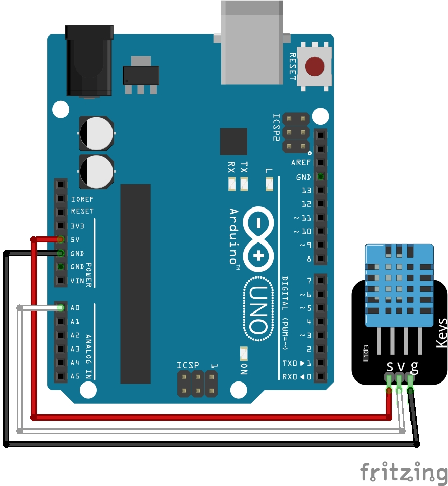

<div align="center">
   <h1>
      What Is The Temperature In My Room
   </h1>
   <p align="center">
      I got bored so I made a website that shows the temperature in my room in real time.
   </p>
   
</div>

## How it works
A DHT11 sensor can detect two different values, the humidity and the temperature. For this small project we are only interested in the last one (the temperature).
To read the value this sensor returns, we can use an Arduino UNO (any Arduino will do the job) this is a microcontroller that we can program so that it reads the current value of the temperature.

So if we connect the pins on the sensor (`GND`, `DATA` and `VCC`) to the Arduino and the [`temp-monitor.ino`](./src/temp-monitor/temp-monitor.ino ) file, we can read the temperature in the serial monitor.
To compile and upload the code to the Arduino you can do the following.

**NOTE**: The commands below assume you are using an Arduino UNO. Refer to the [docs](https://arduino.github.io/arduino-cli/0.27/getting-started/) for more information.

```
$ cd src/                                                                  # Navigate inside the source directory
$ arduino-cli compile --fqbn arduino:avr:uno temp-monitor                  # Compile the code
$ arduino-cli upload -p /dev/ttyACM0 --fqbn arduino:avr:uno temp-monitor   # Upload the compiled code to the Arduino UNO
```

Since on Linux everything is a file, we can read the serial output of the file `/dev/ttyACM0` (if it has the correct permissions [`crw-rw-rw-`](https://forum.arduino.cc/t/permission-denied-on-dev-ttyacm0/475568/4)).
To read this file we can use Python (see the `get_temp` function in the [`temperature-app.py`](./src/temperature-app.py) file) which then prints the value in the command line. In theory we could also simply use Bash to read this, but this will make it a bit harder to do the following step. If you want to try it with Bash it should look simular to the code below.

```bash
while :; do
   while read -r line; do
      printf '%s' "${line}"
      sleep 1
   done < /dev/ttyACM0
done
```

Now that we can read the data from the Arduino, we can do whatever we want with it.
This means that we can also display the data in real time on a website.
Since we are already using Python to read the data, we can also use Python to create the website using the Flask web framework.
This will then host a website at [`http://127.0.0.1:5000/`](http://127.0.0.1:5000/) where we can read the room temperature.

Since Flask won't refresh the data on its own, we have to do a little bit of magic, which is to have the web browser continuously refresh the website. We do this by adding the line below to the html inside the Python script.

```html
<meta http-equiv="refresh" content="1" />
```

To start the web server you can do the following, assuming your current working directory is still the `src` directory.

```
$ python3 temperature-app.py
```

## Electrical scheme



## References

- [Arduino – Read Serial Communication with Raspberry Pi](https://www.elithecomputerguy.com/2020/12/arduino-read-serial-communication-with-raspberry-pi/) by Eli the Computer Guy
- [Arduino CLI Getting started](https://arduino.github.io/arduino-cli/0.27/getting-started/)

