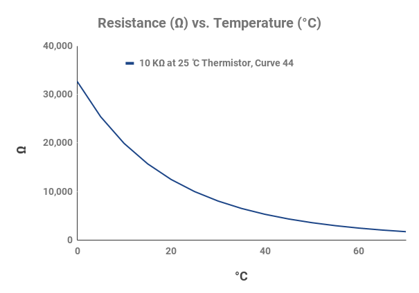
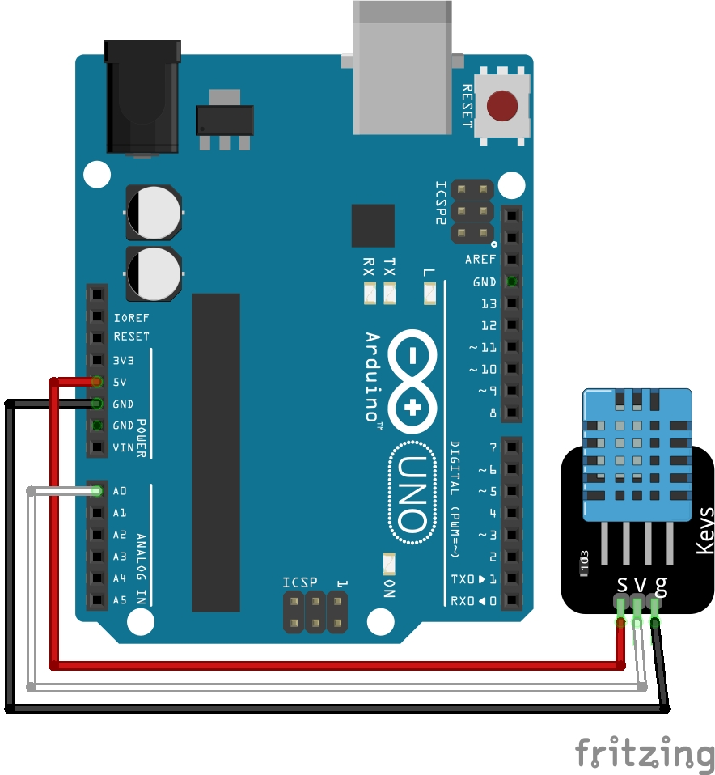
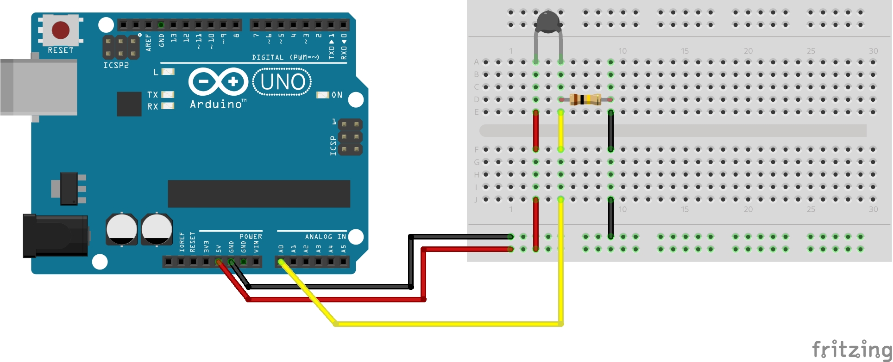

<div align="center">
   <h1>
      What Is The Temperature In My Room
   </h1>
   <p align="center">
      I got bored so I made a website that shows the temperature in my room in real time.
   </p>
   
</div>

## How it works

### DHT11 sensor

A DHT11 sensor can detect two different values, the humidity and the temperature.
For this small project we are only interested in the last one (the temperature).
To read the value this sensor returns, we can use an Arduino UNO (any Arduino will do the job) this is a microcontroller that we can program so that it reads the current value of the temperature.

So if we connect the pins on the sensor (`GND`, `DATA` and `VCC`) to the Arduino and the [`temp-monitor-dht11.ino`](./src/temp-monitor/temp-monitor-dht11.ino) file, we can read the temperature in the serial monitor.

### Thermistor



Personally, I recommend using this method, because after a few tests, the measurements look the most accurate.
As strange as it sounds, this could be due to my DHT11 sensor so this may be different for you.

A thermistor is a variable resistor depending on the ambient temperature, therefore if we measure its value of resistance we can determine the ambient temperature using some clever math.
First, we'll have to let the Arduino measure the voltage at a point between the thermistor and a known resistor (100KΩ in my case).
If we know that $V_{\text{out}} = V_{\text{in}} \cdot \left( \frac{R_2}{R_1 + R_2} \right)$, we can rearrange the equation to calculate $R_2$. This will result in $R_2 = R_1 \cdot \left( \frac{V_{\text{in}}}{V_{\text{out}}} - 1 \right)$.

When we know the value of $R_2$, we can calculate the ambient temperature with the following coefficients: $c_1 = 1.009249522 \times 10^{-3}$, $c_2 = 2.378405444 \times 10^{-4}$, $c_3 = 2.019202697 \times 10^{-7}$.
To calculate the ambient temperature in degrees Celsius, we can use: $T_{\text{Celcius}} = \left( \frac{1.0}{c_1 + (c_2 \cdot \log(R_2)) + (c_3 \cdot \log(R_2) \cdot \log(R_2) \cdot \log(R_2))} \right) - 273.15$ (converting to Fahrenheit: $T = \left( \frac{T_{Celcius} \cdot 9.0}{5.0} \right) + 32.0$). This equation is also known as the [Steinhart-Hart equation](https://en.wikipedia.org/wiki/Steinhart%E2%80%93Hart_equation).

Here are all the formulas in one place:

$$
\begin{align}
   R_2 &= R_1 \cdot \left( \frac{V_{\text{in}}}{V_{\text{out}}} - 1 \right) \\
   T_{\text{Celcius}} &= \left( \frac{1.0}{c_1 + (c_2 \cdot \log(R_2)) + (c_3 \cdot \log(R_2) \cdot \log(R_2) \cdot \log(R_2))} \right) - 273.15 \\
   T_{\text{Fahrenheit}} &= \left( \frac{T_{\text{Celcius}} \cdot 9.0}{5.0} \right) + 32.0
\end{align}
$$

Where:

-   $R_1$ is the resistance of the known resistor (100KΩ in my case)
-   $R_2$ is the resistance of the thermistor
-   $V_{\text{in}}$ is the voltage of the Arduino (5V)
-   $V_{\text{out}}$ is the voltage at the point between the thermistor and the known resistor
-   $c_1 = 1.009249522 \times 10^{-3}$
-   $c_2 = 2.378405444 \times 10^{-4}$
-   $c_3 = 2.019202697 \times 10^{-7}$
-   $T_{\text{Celcius}}$ is the ambient temperature in degrees Celsius
-   $T_{\text{Fahrenheit}}$ is the ambient temperature in degrees Fahrenheit

### Compiling and uploading the code to the Arduino

To compile and upload the code to the Arduino you can do the following.
Replace `<method>` with either `dht11` or `thermistor`, depending on the method you use to measure the temperature.

**NOTE**: The commands below assume you are using an Arduino UNO. Refer to the [docs](https://arduino.github.io/arduino-cli/0.27/getting-started/) for more information.

```console
$ cd src/                                                                           # Navigate inside the source directory
$ arduino-cli compile --fqbn arduino:avr:uno temp-monitor-<method>                  # Compile the code
$ arduino-cli upload -p /dev/ttyACM0 --fqbn arduino:avr:uno temp-monitor-<method>   # Upload the compiled code to the Arduino UNO
```

### Reading from the Serial Monitor

Since on Linux everything is a file, we can read the serial output of the file `/dev/ttyACM0`.
But first we need to update the permissions ([`crw-rw-rw-`](https://forum.arduino.cc/t/permission-denied-on-dev-ttyacm0/475568/4)) to do so you'll have to run the command listed below.
We will have to do this everytime we disconnect and reconnect the Arduino to the computer.

```console
$ sudo chmod a+rw /dev/ttyACM0
```

Alternatively, you can also add your user to the `dialout` group.
This way you don't need to update the permissions everytime you plug in the Arduino.

```console
$ sudo usermod -a -G dialout $USER
```

Now that we are able to read `/dev/ttyACM0` we can use Python (see the `get_temp` function in the [`app.py`](./src/app.py) file) to read the data and then prints the value in the command line.
In theory we could also simply use Bash to read this, but this will make it a bit harder to do the following step.
If you want to try it with Bash it should look simular to the code below.

```bash
while :; do
   while read -r line; do
      printf '%s' "${line}"
      sleep 1
   done < /dev/ttyACM0
done
```

### The web server

Now that we can read the data from the Arduino, we can do whatever we want with it.
This means that we can also display the data in real time on a website.
Since we are already using Python to read the data, we can also use Python to create the website using the Flask web framework.
This will then host a website at [`http://127.0.0.1:5000/`](http://127.0.0.1:5000/) where we can read the room temperature.

Since Flask won't refresh the data on its own, we have to do a little bit of magic, which is to have the web browser continuously refresh the website. We do this by adding the line below to the html inside the Python script.

```html
<meta http-equiv="refresh" content="1" />
```

To start the web server you can do the following, assuming your current working directory is still the `src` directory.

```console
$ python3 app.py
```

### LCD Display (Optional)

For those who would like to add a LCD display to the circuit, so you wouldn't have to run the webserver constantly, you can compile and upload the code in the `temp-monitor-thermistor-lcd` directory (within the `src` directory).
This will display the temperature on the LCD display with a refresh rate of 1 second (it will keep printing the temperature to the serial monitor as well).
Keep in mind that this code requires the use of a thermistor.
If you want to use the DHT11 sensor instead you'll have to change the code a bit by yourself.
I recommend just copying and pasting the code from the other files and adding the LCD display related code to it.
For the electrical circuit you can take a look at the LCD display related parts of another project of mine called [atc](https://github.com/AntonVanAssche/atcs#electrical-scheme) (Automatic Temperature Control System).

```console
$ cd src/                                                                                 # Navigate inside the source directory
$ arduino-cli compile --fqbn arduino:avr:uno temp-monitor-thermistor-lcd                  # Compile the code
$ arduino-cli upload -p /dev/ttyACM0 --fqbn arduino:avr:uno temp-monitor-thermistor-lcd   # Upload the compiled code to the Arduino UNO
```

## Electrical scheme

### Using the DHT11 sensor



### Using the thermistor



## References

-   [Arduino – Read Serial Communication with Raspberry Pi](https://www.elithecomputerguy.com/2020/12/arduino-read-serial-communication-with-raspberry-pi/) by Eli the Computer Guy
-   [Arduino CLI Getting started](https://arduino.github.io/arduino-cli/0.27/getting-started/)
